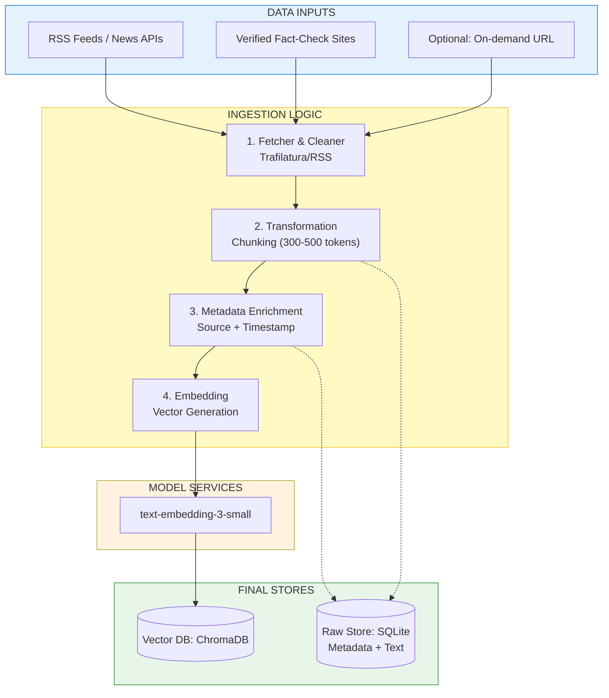
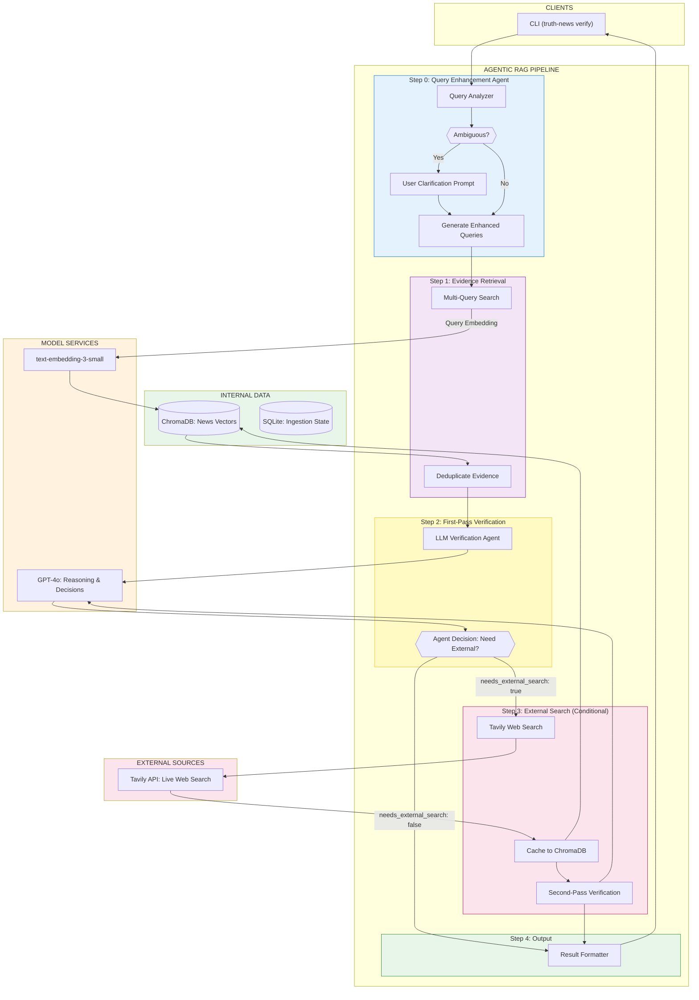
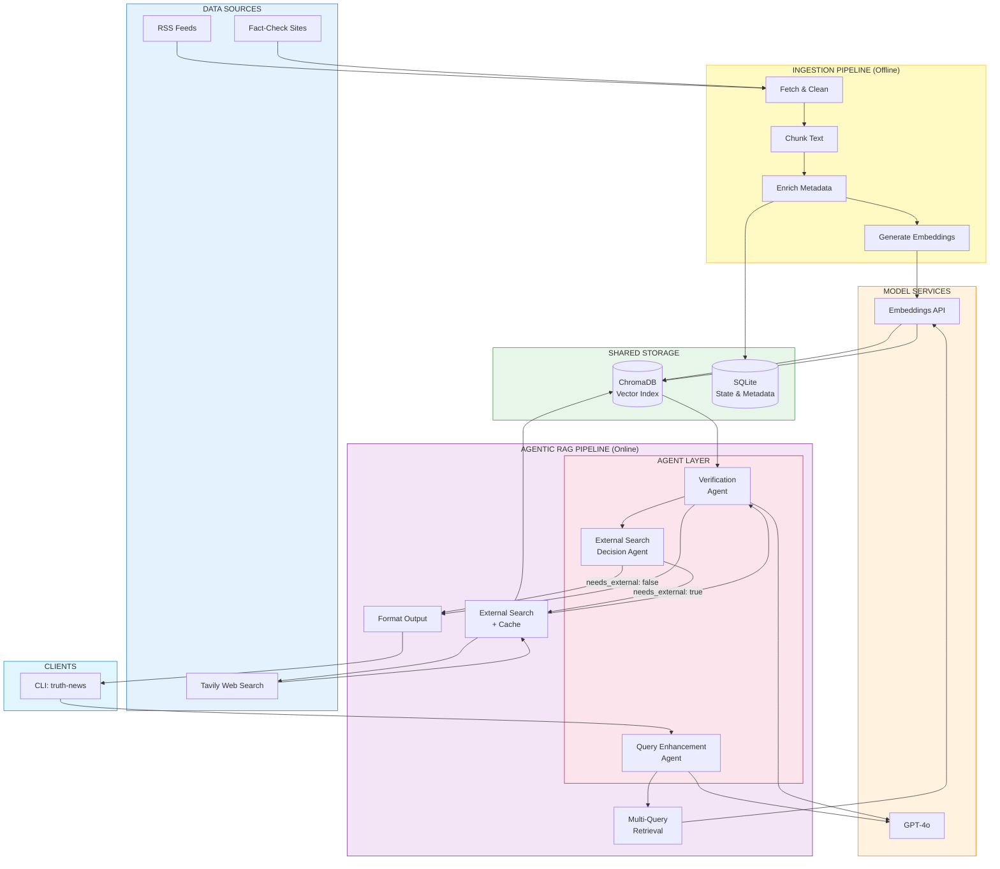

# Truth Detector - Agentic RAG Architecture

## System Overview

The Truth Detector consists of two main pipelines:
1. **Data Ingestion Pipeline** - Fetches, processes, and indexes news articles
2. **Agentic RAG Pipeline** - Verifies claims using intelligent retrieval and reasoning

---

## 1. Data Ingestion Pipeline



### Ingestion Pipeline Stages

| Stage | Description | Output |
|-------|-------------|--------|
| **1. Fetch & Clean** | Pull RSS feeds, extract article text using Trafilatura | Clean article text |
| **2. Chunking** | Split articles into 300-500 token chunks with overlap | Text chunks |
| **3. Metadata** | Attach source, URL, publish date, trust rank | Enriched chunks |
| **4. Embedding** | Generate vectors using OpenAI embeddings | 1536-dim vectors |

### CLI Commands

```bash
# Ingest recent articles (last 60 minutes)
truth-news ingest --since-minutes 60

# Backfill older articles
truth-news backfill --days 7

# Check ingestion health
truth-news health

# Reset data
truth-news reset --full --yes
```

---

## 2. Agentic RAG Verification Pipeline



## Agentic Features

### 1. Query Enhancement Agent (Pre-Retrieval)
- **Purpose**: Optimize user claims for better retrieval
- **Capabilities**:
  - Entity extraction (people, orgs, dates, locations)
  - Ambiguity detection (e.g., "the president" without country context)
  - Interactive user clarification when ambiguous
  - Multi-query generation for broader evidence coverage
- **CLI Flag**: `--no-enhance` to disable

### 2. Agentic External Search Decision (Post-First-Pass)
- **Purpose**: LLM decides if external search is needed (replaces hardcoded threshold)
- **Decision Factors**:
  - Evidence quality and recency
  - Confidence level from first-pass verification
  - Whether internal evidence is sufficient
- **Output Fields**:
  - `needs_external_search`: boolean decision
  - `search_rationale`: reasoning for the decision
  - `suggested_search_query`: optimized query for external search
- **CLI Flag**: `--no-external` to disable external search entirely

## Data Flow Summary

```
User Claim
    │
    ▼
┌─────────────────────────────────────┐
│  Query Enhancement Agent            │
│  - Analyze claim                    │
│  - Detect ambiguity                 │
│  - Prompt user if needed            │
│  - Generate enhanced queries        │
└─────────────────────────────────────┘
    │
    ▼
┌─────────────────────────────────────┐
│  Multi-Query Retrieval              │
│  - Search ChromaDB with 1-3 queries │
│  - Deduplicate evidence chunks      │
└─────────────────────────────────────┘
    │
    ▼
┌─────────────────────────────────────┐
│  First-Pass Verification            │
│  - Analyze evidence                 │
│  - Generate verdict + confidence    │
│  - Decide: need external search?    │
└─────────────────────────────────────┘
    │
    ├── needs_external_search: false ──► Output Result
    │
    ▼ needs_external_search: true
┌─────────────────────────────────────┐
│  External Search (Tavily)           │
│  - Use suggested_search_query       │
│  - Cache results to ChromaDB        │
└─────────────────────────────────────┘
    │
    ▼
┌─────────────────────────────────────┐
│  Second-Pass Verification           │
│  - Combined internal + external     │
│  - Final verdict + confidence       │
└─────────────────────────────────────┘
    │
    ▼
Output Result with:
- Query enhancement info (original vs enhanced)
- Verdict, confidence, reasoning
- Supporting/contradicting evidence with URLs
- Source breakdown (internal vs external)
```

## Files Structure

```
app/verify/
├── enhance.py      # Query Enhancement Agent
├── retrieve.py     # ChromaDB evidence retrieval
├── analyze.py      # Verification engine + agentic decision
├── search.py       # Tavily external search + caching
├── output.py       # Result formatting
└── parse.py        # Claim parsing utilities
```

## CLI Usage

```bash
# Standard verification (with all agentic features)
truth-news verify "The president announced new AI regulations"

# Skip query enhancement
truth-news verify --no-enhance "Biden announced new AI regulations"

# Skip external search
truth-news verify --no-external "Tesla stock dropped 10%"

# Both disabled (raw claim, internal only)
truth-news verify --no-enhance --no-external "Some claim"
```

---

## 3. Combined System Architecture



### System Integration Points

| Component | Ingestion Pipeline | Verification Pipeline |
|-----------|-------------------|----------------------|
| **ChromaDB** | Writes indexed chunks | Reads for retrieval, writes external cache |
| **SQLite** | Tracks ingestion state | Not used directly |
| **Embedding Model** | Generates chunk vectors | Generates query vectors |
| **LLM (GPT-4o)** | Not used | Query enhancement, verification, decisions |
| **Tavily** | Not used | On-demand external search |

### Data Lifecycle

```
┌─────────────────────────────────────────────────────────────────┐
│                     OFFLINE (Batch)                              │
│  RSS/News ──► Fetch ──► Chunk ──► Embed ──► ChromaDB            │
│                                              ▲                   │
└──────────────────────────────────────────────│───────────────────┘
                                               │
                                               │ cached external
                                               │ results
┌──────────────────────────────────────────────│───────────────────┐
│                     ONLINE (Real-time)       │                   │
│  User Claim ──► Enhance ──► Retrieve ────────┴──► Verify         │
│                    │                                  │          │
│                    │         ┌────────────────────────┤          │
│                    │         │ needs_external: true   │          │
│                    │         ▼                        ▼          │
│                    │      Tavily ──► Cache      Output Result    │
│                    │         │                                   │
│                    │         └──► Re-verify ──► Output Result    │
└─────────────────────────────────────────────────────────────────┘
```

---

## Complete Files Structure

```
truth-detector/
├── app/
│   ├── cli.py                 # Main CLI entry point
│   ├── config/
│   │   ├── sources.yaml       # RSS source configuration
│   │   └── loader.py          # Config loader
│   ├── common/
│   │   ├── http.py            # HTTP utilities
│   │   ├── hashing.py         # Hash functions
│   │   ├── logging.py         # Logging setup
│   │   └── time.py            # Time utilities
│   ├── ingest/                # INGESTION PIPELINE
│   │   ├── fetch_rss.py       # RSS fetching
│   │   ├── extract_article.py # Article extraction
│   │   ├── clean.py           # Text cleaning
│   │   ├── dedupe.py          # Deduplication
│   │   ├── chunk.py           # Text chunking
│   │   ├── embed.py           # Embedding generation
│   │   └── index.py           # ChromaDB indexing
│   ├── verify/                # VERIFICATION PIPELINE
│   │   ├── enhance.py         # Query Enhancement Agent
│   │   ├── retrieve.py        # Evidence retrieval
│   │   ├── analyze.py         # Verification + agentic decision
│   │   ├── search.py          # External search + caching
│   │   ├── output.py          # Result formatting
│   │   └── parse.py           # Claim parsing
│   └── store/
│       ├── sqlite.py          # SQLite operations
│       └── chroma.py          # ChromaDB operations
├── data/
│   ├── news.db                # SQLite database
│   └── chroma/                # ChromaDB persistence
└── pyproject.toml             # Dependencies
```
